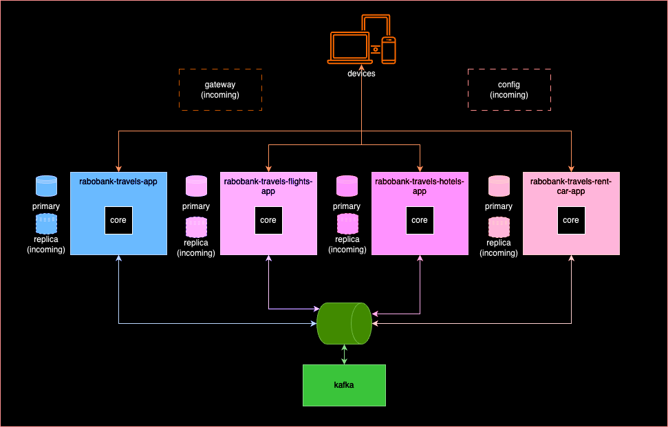

# RABOBANK-TRAVELS

This is a project for a test.

This project is about a travel agency and coverage this technologies:

- Pub/Sub pattern
- CQRS
- Circuit Breaker
- API Proxy

## Desing

## How can start?

To start this project it's necessary:

- Java 21+ (microsoft-21: https://learn.microsoft.com/pt-br/java/openjdk/download#openjdk-21)
- Docker
- Maven

### Docs
- https://www.baeldung.com/spring-kafka
